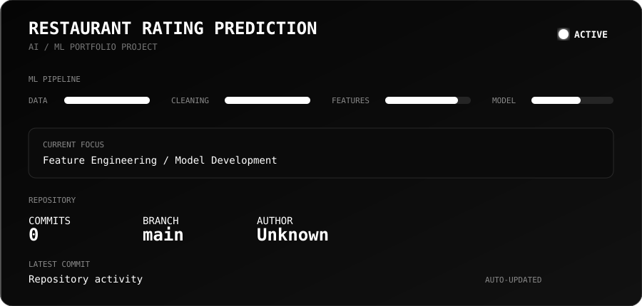

# 🍽️ Restaurant Rating Prediction

> **An end-to-end Machine Learning project for predicting restaurant ratings from restaurant characteristics.**

This project explores how machine learning regression techniques can be used to predict a restaurant's **Aggregate Rating** using information such as pricing, votes, cuisine, location, services, and other restaurant-level attributes.

The project is primarily a **learning and portfolio project** focused on understanding the complete machine learning workflow, from raw data preprocessing to model evaluation and feature interpretation.

---

## 🎯 Project Objective

The main objective is to develop a regression-based machine learning system that learns relationships between restaurant characteristics and their ratings.

The project focuses on:

- 🧹 Data cleaning and preprocessing
- 🔎 Exploratory Data Analysis (EDA)
- 🛠️ Feature engineering
- 🔤 Categorical feature encoding
- 📊 Feature selection
- 🤖 Regression model training
- ⚖️ Model comparison
- 📈 Model evaluation
- 🔍 Feature importance and model interpretation
- 🔄 Reproducible ML workflow

---

## 🧠 Problem Statement

Restaurant ratings can depend on several factors, including:

- Number of customer votes
- Price range
- Average cost
- Cuisine type
- Online delivery availability
- Table booking availability
- Restaurant location
- Other restaurant characteristics

The goal of this project is to investigate whether these features contain enough information to build a useful regression model for predicting:

### **Target Variable**
`Aggregate Rating`

This is treated as a **regression problem** because the model predicts a numerical rating rather than a discrete class.

---

## 📊 Dataset

The dataset contains restaurant-level information such as:

| Feature | Description |
|---|---|
| Restaurant Name | Name of the restaurant |
| City | Restaurant city |
| Locality | Restaurant locality |
| Cuisines | Cuisine information |
| Average Cost for Two | Approximate cost for two people |
| Currency | Currency used for pricing |
| Price Range | Restaurant price category |
| Online Delivery | Whether online delivery is available |
| Table Booking | Whether table booking is available |
| Votes | Number of votes received |
| Aggregate Rating | Restaurant rating used as the target |
| Rating Color | Rating category/color |
| Rating Text | Text representation of rating |
| Other Features | Additional restaurant attributes |

### Target

```text
Aggregate Rating
```

---

# 🔄 Machine Learning Pipeline

```text
Raw Dataset
     │
     ▼
Data Inspection
     │
     ▼
Data Cleaning
     │
     ├── Missing Values
     ├── Duplicates
     ├── Invalid Values
     └── Irrelevant Features
     │
     ▼
Exploratory Data Analysis
     │
     ├── Distributions
     ├── Correlations
     ├── Categorical Analysis
     └── Outlier Analysis
     │
     ▼
Feature Engineering
     │
     ├── Numerical Features
     ├── Categorical Features
     └── Derived Features
     │
     ▼
Feature Encoding
     │
     ▼
Train / Test Split
     │
     ▼
Regression Models
     │
     ├── Baseline Model
     ├── Linear Regression
     ├── Tree-Based Models
     └── Other Regression Models
     │
     ▼
Model Evaluation
     │
     ├── MAE
     ├── MSE
     ├── RMSE
     └── R² Score
     │
     ▼
Feature Importance
     │
     ▼
Final Model
```

---

# 🔬 Exploratory Data Analysis

EDA is used to understand the structure and behavior of the dataset before model training.

The analysis includes:

- Distribution of restaurant ratings
- Distribution of votes
- Price distribution
- Relationship between votes and ratings
- Relationship between price and ratings
- Cuisine-related patterns
- Delivery and table-booking patterns
- Missing-value analysis
- Outlier detection
- Correlation analysis

Visualizations are created using **Matplotlib** and **Seaborn**.

---

# 🛠️ Feature Engineering

Feature engineering is an important part of the project because raw restaurant information is not always directly suitable for machine learning models.

The project explores transformations such as:

- Numerical feature transformations
- Categorical encoding
- Binary feature encoding
- Derived pricing features
- Vote-related transformations
- Handling high-cardinality categorical variables
- Feature selection

The objective is not simply to throw every column into a model and hope the algorithm develops consciousness.

---

# 🤖 Models

Different regression approaches can be trained and compared to understand their behavior on the dataset.

Potential models include:

- Linear Regression
- Decision Tree Regressor
- Random Forest Regressor
- Gradient Boosting Regressor
- Other suitable regression algorithms

Model selection is based on measurable evaluation metrics rather than assuming that a more complicated model is automatically better.

---

# 📏 Model Evaluation

The models are evaluated using standard regression metrics.

### Mean Absolute Error

Measures the average absolute difference between predicted and actual ratings.

```text
MAE = average(|actual - predicted|)
```

Lower values indicate smaller average prediction errors.

### Mean Squared Error

Penalizes larger prediction errors more strongly.

```text
MSE = average((actual - predicted)²)
```

### Root Mean Squared Error

The square root of MSE, expressed in the same units as the target variable.

```text
RMSE = √MSE
```

### R² Score

Measures how much of the variation in the target variable is explained by the model.

```text
R² = 1 - SSres / SStot
```

The final model will be selected based on the overall evaluation results and the project's objectives.

---

# 🔍 Feature Importance

Feature importance analysis is used to investigate which variables contribute most strongly to the predictions of supported models.

This helps answer questions such as:

- Does the number of votes provide useful predictive information?
- How important is restaurant pricing?
- Do service-related features contribute to predictions?
- Do encoded cuisine features provide useful information?
- Which features have little predictive value?

Feature importance is treated as a model interpretation tool rather than proof of causation.

---

# 📁 Project Structure

```text
Restaurant-Rating-Prediction/
│
├── data/
│   ├── raw/
│   │   └── dataset.csv
│   │
│   └── processed/
│       └── processed_dataset.csv
│
├── notebooks/
│   ├── 01_EDA.ipynb
│   ├── 02_Preprocessing.ipynb
│   ├── 03_Model_Training.ipynb
│   └── 04_Model_Evaluation.ipynb
│
├── models/
│   └── trained_model.pkl
│
├── outputs/
│   ├── plots/
│   └── reports/
│
├── .github/
│   └── workflows/
│       └── repository-activity.yml
│
├── requirements.txt
├── README.md
└── .gitignore
```

---

# 💻 Technologies & Libraries

### Programming Language

- Python

### Data Processing

- NumPy
- Pandas

### Data Visualization

- Matplotlib
- Seaborn

### Machine Learning

- Scikit-learn

### Model Persistence

- Joblib

### Automation

- GitHub Actions

---

# 📚 Learning Outcomes

Through this project, I practiced and explored:

- Data preprocessing
- Missing-value handling
- Exploratory Data Analysis
- Feature engineering
- Categorical encoding
- Regression techniques
- Train-test splitting
- Model comparison
- Regression evaluation metrics
- Feature importance
- Model persistence
- Git and GitHub workflow automation

The project is intended to strengthen practical understanding of the **end-to-end machine learning development process**, rather than being presented as a production-ready restaurant recommendation platform.

---

# 🚧 Current Status

**Project Stage:** 🚀 Active Development

```text
[████████████████░░░░] ML Pipeline Development
```

Current focus:

- [x] Dataset exploration
- [x] Data cleaning
- [x] Initial feature engineering
- [x] Encoding experiments
- [ ] Final feature selection
- [ ] Regression model comparison
- [ ] Hyperparameter tuning
- [ ] Final model evaluation
- [ ] Model interpretation
- [ ] Portfolio documentation

---

# 🔮 Future Improvements

Possible extensions include:

- Hyperparameter optimization
- Cross-validation
- Better handling of high-cardinality categorical features
- Automated ML experiment tracking
- Model explainability with SHAP
- REST API for predictions
- Interactive prediction interface
- Dockerized deployment
- Cloud deployment
- Automated model retraining pipeline

---

# ⚠️ Project Limitations

Restaurant ratings are influenced by many factors that may not be available in the dataset.

Therefore:

- Predictions should not be interpreted as objective restaurant quality scores.
- Feature importance does not necessarily imply causation.
- Dataset bias can affect model behavior.
- Model performance depends on the quality and distribution of the available data.
- Geographic and restaurant-specific patterns may not generalize to unseen locations.

---

# 📌 Project Purpose

This project was created as part of my **AI/ML learning and portfolio development** to gain practical experience with regression, data preprocessing, feature engineering, model evaluation, and machine learning workflows.

It is an evolving project, and the pipeline may change as new experiments and techniques are explored.

---

## 📜 License

This project is created for **educational and portfolio purposes**.

---

## 👨‍💻 Author

**Shrijit**

Exploring:

```text
Python → Data Science → Machine Learning → AI Engineering
```

> Building, breaking, debugging, learning, and occasionally wondering why the model decided that was a good idea.


<!-- ACTIVITY_START -->

## ⚡ Repository Activity

| Metric | Value |
|---|---|
| Latest Commit | `chore: update repository activity` |
| Author | github-actions[bot] |
| Commit | `3bfbcfd` |
| Event | `schedule` |
| Branch | `main` |
| Total Commits | `30` |
| Last Updated | `2026-10-02 21:48 UTC` |

> Automatically generated by GitHub Actions.

<!-- ACTIVITY_END -->
> Automatically generated by GitHub Actions.

<!-- ACTIVITY_END -->


<!-- STATUS_START -->

## 🚧 Project Status

<p align="center">
  
</p>
```

> 🔄 Automatically updated by GitHub Actions based on repository activity.

<!-- STATUS_END -->
